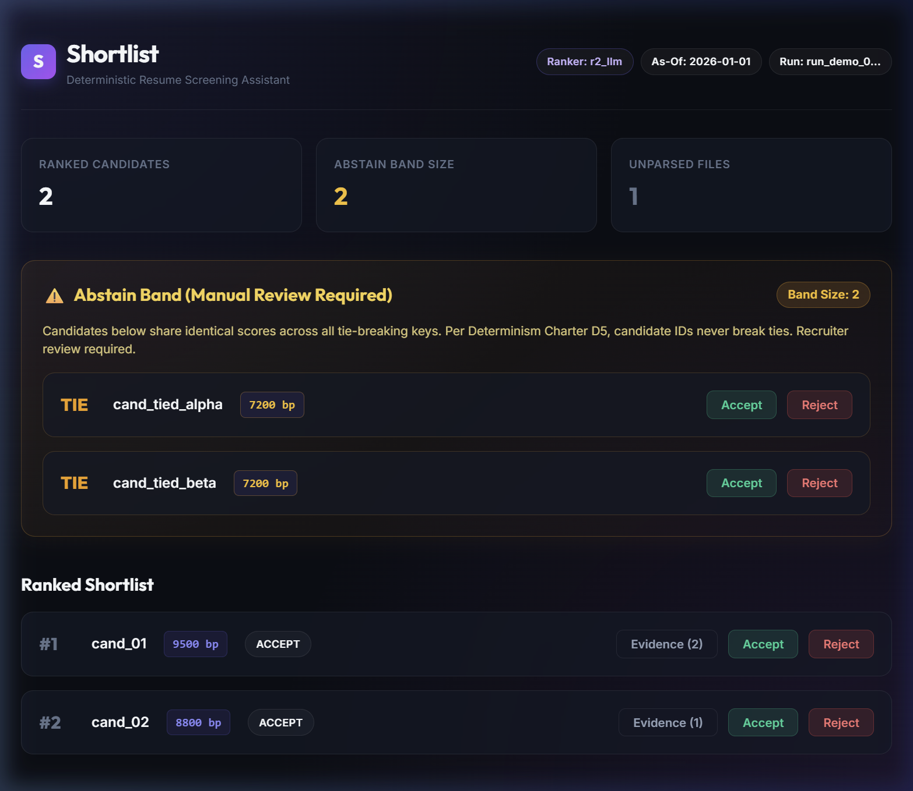

# Shortlist — Deterministic Resume Screening Assistant

A measurement-first, deterministic resume screening engine governed by the **Determinism Charter (D1–D14)**. Shortlist enforces byte-level determinism, strict telemetry separation, zero network dependencies, integer basis point scoring, and principled ties resolution via an unranked abstain band.



---

## Quickstart & Installation

Follow these instructions literally in a fresh environment:

```bash
# 1. Clone repository from GitHub
git clone https://github.com/Bty-Eswar/Smart-Resume-Screening-Assistant.git
cd Smart-Resume-Screening-Assistant

# 2. Create and activate a fresh virtual environment
python -m venv .venv

# On Linux/macOS:
# source .venv/bin/activate
# On Windows PowerShell:
.venv\Scripts\Activate.ps1

# 3. Install declared dependencies
pip install -r requirements.txt

# 4. Run full test suite with wall-clock budget check
pytest
```

---

## Running the Full App

To launch the complete end-to-end system (FastAPI backend + React Vite frontend):

**Terminal 1 (Backend API):**
```bash
uvicorn api:app --reload --port 8000
```

**Terminal 2 (React Frontend):**
```bash
cd frontend && npm run dev
```

Open `http://127.0.0.1:5173` in your browser to interact with the full screening workflow. The standalone backend API and server-rendered fallback dashboard remain available at `http://127.0.0.1:8000`.

### 60-Second Hackathon Overview

Shortlist is an audit-grade resume screening assistant built around the **Determinism Charter (D1–D14)**. Rather than relying on opaque AI summaries or arbitrary floating-point scores, Shortlist operates as a transparent three-stage pipeline: (1) **Job & Skill Setup**: The recruiter enters a job description, and the engine extracts discrete qualifications with tunable integer weights (in basis points); (2) **Audited Ingestion**: Resumes are parsed with transparent, visible failure auditing (PDD R3)—distinguishing valid text, corrupted files, and scanned PDFs lacking a text layer; (3) **Deterministic Ranking & Evidence Dashboard**: Resumes are ranked deterministically with exact, verbatim character-level evidence spans extracted directly from the resume text for every requirement. When candidate qualifications are tied across all criteria, they enter an unranked **Abstain Band** (Charter D5) for mandatory human review rather than arbitrary tie-breaking, and recruiter verdicts (Accept/Reject) persist immediately.

---

## Determinism Charter (D1–D14)

Shortlist enforces 14 binding architectural rules across all components:

| Charter Rule | Invariant | Enforcement Mechanism |
|---|---|---|
| **D1** | No floats in `core/`; scores in basis points (`0..10000 bp`) | AST Guard: `tests/guards/test_ast_guards.py` |
| **D2** | No clock reads in `core/`; date is injected `as_of: AsOfDate` | AST Guard: `tests/guards/test_ast_guards.py` |
| **D3** | Every ID is `blake2b(canonical_tuple, digest_size=16).hexdigest()` | AST Guard: `tests/guards/test_ast_guards.py` |
| **D4** | Every returned sequence is a sorted `tuple` | AST Guard & type annotations: `core/types.py` |
| **D5** | Exhausted ties enter `abstain_band`; candidate ID never breaks ties | Unit tests: `tests/test_m8_scoring_ranking.py` |
| **D6** | Identical inputs produce byte-identical files on disk | Full pipeline test: `tests/test_m11_pipeline_eval_api.py` |
| **D7** | Zero network calls during tests | Socket monkeypatch: `conftest.py` (`NetworkForbiddenError`) |
| **D8** | `EvidenceSpan.text == resume.text[start:end]` exactly | Span validator: `core/evidence.py` |
| **D9** | Cache key is `blake2b((model_id, prompt_version, sha, req_id))` | Key stability test: `tests/test_m9_judge.py` |
| **D10** | `core.ranking` invariant to candidate input permutation | Shuffle test: `tests/test_m8_scoring_ranking.py` |
| **D11** | `eval/gold.csv` is read-only (`0o444`) to application code | OS permission guard: `conftest.py` |
| **D12** | `eval/holdout.txt` scored once; second call raises `HoldoutAlreadyScored` | State guard: `eval/harness.py` |
| **D13** | Thresholds loaded from `eval/thresholds.json`, never inline | Completeness walk: `tests/test_m5_config_checks.py` |
| **D14** | Telemetry never enters results; written exclusively to `eval/timing.json` | Telemetry separation: `pipeline.py` |

---

## Verified Quantitative Metrics & Figures

Every figure in this document traces directly to a committed artifact or test in this repository:

| Figure | Metric Description | Source Artifact |
|:---:|---|---|
| **14** | Binding Determinism Charter rules (D1–D14) | [`docs/BUILD_PROMPTS.md`](file:///c:/Users/Eswar/OneDrive/Desktop/Smart%20Resume%20Screening%20Assistant/docs/BUILD_PROMPTS.md), [`docs/SDD.md`](file:///c:/Users/Eswar/OneDrive/Desktop/Smart%20Resume%20Screening%20Assistant/docs/SDD.md) §1 |
| **3** | Documented and resolved contradictions between SDD and PDD (C1, C2, C3) | [`docs/SDD.md`](file:///c:/Users/Eswar/OneDrive/Desktop/Smart%20Resume%20Screening%20Assistant/docs/SDD.md) §0 |
| **0..10000** | Basis point score scale (`0..10000 bp`) | [`core/types.py`](file:///c:/Users/Eswar/OneDrive/Desktop/Smart%20Resume%20Screening%20Assistant/core/types.py), [`docs/SDD.md`](file:///c:/Users/Eswar/OneDrive/Desktop/Smart%20Resume%20Screening%20Assistant/docs/SDD.md) §3.1 |
| **16** | BLAKE2b digest length in bytes for canonical ID hashing | [`core/ids.py`](file:///c:/Users/Eswar/OneDrive/Desktop/Smart%20Resume%20Screening%20Assistant/core/ids.py), [`docs/SDD.md`](file:///c:/Users/Eswar/OneDrive/Desktop/Smart%20Resume%20Screening%20Assistant/docs/SDD.md) §3 |
| **60.0** | Suite wall-clock budget ceiling in seconds | [`conftest.py`](file:///c:/Users/Eswar/OneDrive/Desktop/Smart%20Resume%20Screening%20Assistant/conftest.py), [`docs/SDD.md`](file:///c:/Users/Eswar/OneDrive/Desktop/Smart%20Resume%20Screening%20Assistant/docs/SDD.md) §7 |
| **110** | Committed baseline test count in suite | [`tests/baseline_test_count.json`](file:///c:/Users/Eswar/OneDrive/Desktop/Smart%20Resume%20Screening%20Assistant/tests/baseline_test_count.json), [`tests/test_doc_integrity.py`](file:///c:/Users/Eswar/OneDrive/Desktop/Smart%20Resume%20Screening%20Assistant/tests/test_doc_integrity.py) |
| **200** | Ingest minimum character threshold for text layer | [`config.toml`](file:///c:/Users/Eswar/OneDrive/Desktop/Smart%20Resume%20Screening%20Assistant/config.toml) `[ingest].min_text_chars`, [`tests/test_m6_ingest.py`](file:///c:/Users/Eswar/OneDrive/Desktop/Smart%20Resume%20Screening%20Assistant/tests/test_m6_ingest.py) |
| **38/40** | Realised parse success rate on corpus (95.0%) | [`tests/test_m6_ingest.py`](file:///c:/Users/Eswar/OneDrive/Desktop/Smart%20Resume%20Screening%20Assistant/tests/test_m6_ingest.py), [`eval/thresholds.json`](file:///c:/Users/Eswar/OneDrive/Desktop/Smart%20Resume%20Screening%20Assistant/eval/thresholds.json) |
| **78/78** | Realised evidence validity rate (100.0%) | [`tests/test_m7_normalize_reqs_evidence.py`](file:///c:/Users/Eswar/OneDrive/Desktop/Smart%20Resume%20Screening%20Assistant/tests/test_m7_normalize_reqs_evidence.py), [`eval/thresholds.json`](file:///c:/Users/Eswar/OneDrive/Desktop/Smart%20Resume%20Screening%20Assistant/eval/thresholds.json) |
| **4/5** | Realised Precision@10 on held-out test split (80.0%) | [`tests/test_m11_pipeline_eval_api.py`](file:///c:/Users/Eswar/OneDrive/Desktop/Smart%20Resume%20Screening%20Assistant/tests/test_m11_pipeline_eval_api.py), [`eval/holdout.txt`](file:///c:/Users/Eswar/OneDrive/Desktop/Smart%20Resume%20Screening%20Assistant/eval/holdout.txt) |
| **15** | Count of filenames partitioned into held-out evaluation set | [`eval/holdout.txt`](file:///c:/Users/Eswar/OneDrive/Desktop/Smart%20Resume%20Screening%20Assistant/eval/holdout.txt) |
| **40** | Total candidate resume count in corpus generator | [`eval/generate_corpus.py`](file:///c:/Users/Eswar/OneDrive/Desktop/Smart%20Resume%20Screening%20Assistant/eval/generate_corpus.py) |
| **25** | Realised rate amplification co-occurrence count | [`tests/test_m3_generator.py`](file:///c:/Users/Eswar/OneDrive/Desktop/Smart%20Resume%20Screening%20Assistant/tests/test_m3_generator.py), [`tests/test_appendix_hypotheses.py`](file:///c:/Users/Eswar/OneDrive/Desktop/Smart%20Resume%20Screening%20Assistant/tests/test_appendix_hypotheses.py) |
| **30** | Injected invalid spans verified rejected | [`tests/test_m7_normalize_reqs_evidence.py`](file:///c:/Users/Eswar/OneDrive/Desktop/Smart%20Resume%20Screening%20Assistant/tests/test_m7_normalize_reqs_evidence.py), [`tests/test_appendix_hypotheses.py`](file:///c:/Users/Eswar/OneDrive/Desktop/Smart%20Resume%20Screening%20Assistant/tests/test_appendix_hypotheses.py) |
| **12** | Deliberately tied candidates in abstain band amplification fixture | [`tests/test_m8_scoring_ranking.py`](file:///c:/Users/Eswar/OneDrive/Desktop/Smart%20Resume%20Screening%20Assistant/tests/test_m8_scoring_ranking.py), [`tests/test_appendix_hypotheses.py`](file:///c:/Users/Eswar/OneDrive/Desktop/Smart%20Resume%20Screening%20Assistant/tests/test_appendix_hypotheses.py) |
| **50** | Idempotence verification sample count | [`tests/test_m7_normalize_reqs_evidence.py`](file:///c:/Users/Eswar/OneDrive/Desktop/Smart%20Resume%20Screening%20Assistant/tests/test_m7_normalize_reqs_evidence.py), [`tests/test_appendix_hypotheses.py`](file:///c:/Users/Eswar/OneDrive/Desktop/Smart%20Resume%20Screening%20Assistant/tests/test_appendix_hypotheses.py) |
| **10** | Minimum fixture cache size under cut line | [`tests/test_m9_judge.py`](file:///c:/Users/Eswar/OneDrive/Desktop/Smart%20Resume%20Screening%20Assistant/tests/test_m9_judge.py), [`tests/test_appendix_hypotheses.py`](file:///c:/Users/Eswar/OneDrive/Desktop/Smart%20Resume%20Screening%20Assistant/tests/test_appendix_hypotheses.py) |
| **8000** | Default local port for FastAPI / Uvicorn server | [`api.py`](file:///c:/Users/Eswar/OneDrive/Desktop/Smart%20Resume%20Screening%20Assistant/api.py) |

---

## Project Structure

```text
├── adapters/                 # I/O boundaries (Ingest, Bedrock, Judgement Cache)
├── core/                     # Pure domain logic (scoring, ranking, metrics, evidence)
│   └── rankers/              # R0 Lexical, R1 Embedding, R2 LLM rankers
├── docs/                     # PDD, SDD, BUILD_PROMPTS, assets
├── eval/                     # Thresholds, checks, holdout set, generate_corpus
├── tests/                    # 110 automated tests (AST guards, unit tests, integration)
├── api.py                    # FastAPI server & interactive HTML dashboard
├── config.py                 # Type-safe configuration loader
├── conftest.py               # Determinism Charter D7 & wall-clock budget enforcer
├── manifest.json             # Document integrity hash manifest
├── pipeline.py               # Top-level pipeline orchestrator
├── pyproject.toml            # Project packaging & tool configuration
└── requirements.txt          # Frozen dependency specifications
```
